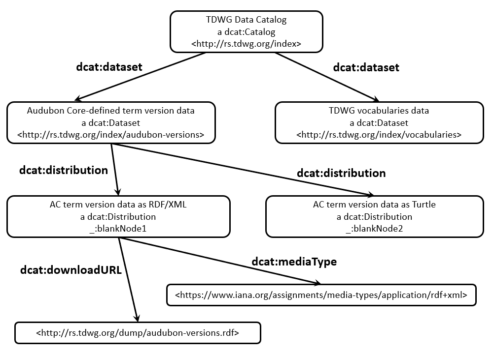

# TDWG Standards Metadata

**Title:** Biodiversity Information Standards (TDWG) Standards Metadata

**Date Version Issued:** 2020-02-03

**Date Created:** 2017-10-10

**Part of TDWG Standard:** Not part of any standard

**This version:** `http://rs.tdwg.org/index/2020-02-03`

**Latest version:** <http://rs.tdwg.org/index>

**Previous version:** [http://rs.tdwg.org/index/2017-10-10](README-2017-10-10.md)

**Abstract:** This repository contains the source CSV files containing the metadata necessary to generate human- and machine-readable representations of the various components of [Biodiversity Information Standards (TDWG)](http://www.tdwg.org/) standards in accordance with the [TDWG Standards Documentation Specification](https://github.com/tdwg/vocab/blob/master/sds/documentation-specification.md)). This document represents the human-readable representation of the TDWG Standards data catalog.

**Contributors:** Steve Baskauf (TDWG Technical Architecture Group, TDWG Audubon Core Maintenance Group, TDWG Darwin Core Maintenance Group)

**Bibliographic citation:** Biodiversity Information Standards. 2020. Biodiversity Information Standards (TDWG) Standards Metadata http://rs.tdwg.org/index

# Table of Contents

[1 Metadata model for TDWG standards](#model)  
[2 IRI patterns](#patterns)  
[2.1 Patterns for current resources in the standards hierarchy](#patterns-current)  
[2.2 Patterns for versions of resources in the standards hierarchy](#patterns-versions)  
[3 About directories in this repository](#directories)  
[3.1 Relationship of parts of this repository to the metadata model](#directories-relationships)  
[3.2 Files contained in current resources directories](#directories-files)  
[3.3 Files contained in versions directories](#directories-versions)  
[3.4 Retrieving machine readable metadata from the datasets](#directories-machine-readable)  
[4 Relationships of directories to resources in the TDWG Standards model](#directories-resources)  
[4.1 Metadata about ratified TDWG Standards](#standards-metadata)  
[4.2 Utility metadata not governed by TDWG Standards](#utility-metadata)  
[4.3 Metadata about obsolete pre-standard versions of Darwin Core](#obsolete-metadata)  

# <a name="model"></a>1 Metadata model for TDWG standards


Fig. 1. TDWG Standards hierarchy model (image from [Standards Documentation Standard GitHub repository](https://github.com/tdwg/vocab/blob/master/hierarchy-model.md))

The TDWG Standards Documentation Specification (http://www.tdwg.org/standards/147) defines a hierarchical model for components of TDWG Standards (Fig. 1).  At the highest level (1st level) are Standards.  All TDWG Standards are linked by virtue of a common *publisher* relationship with TDWG itself.  Documents and Vocabularies (2nd level) are the parts of Standards.  Vocabularies are composed of Term Lists (3rd level), which correspond roughly to namespaces that define sets of terms.  The Term Lists are composed of Terms (4th level), which may be Properties, Classes, or Concepts.  

Each of the levels in the standards hierarchy are linked to the level above by a *isPartOf* relationsip, and to the level below by a *hasPart* relationship.  


Fig. 2. Version model used to describe standards-related resources (image from the [Standards Documentation Specification](https://github.com/tdwg/vocab/blob/master/sds/documentation-specification.md))

Any resource in the hierarchy above can be considered to consist of an abstract resource that persists over time, referred to as a "current resource".  In Fig. 2, the arrow represents a current resource named *ex:resource*.  A current resource has a *creation* date, and a last *modified* date.

The state of current resources over time is documented by versions of that resource.  The versions are "snapshots" of the resource at a particular instant in time.  In Fig. 2, the vertical lines represent versions - for example the version named `ex:resource-2009-07-18`.  

The state of most properties of a current resource at the present time are shared by the most recent version of that resource. The properties of a current resource may change when a new version is issued.  The *issued* date of the new version becomes the *modified* date of the current resource.

A current resource is related to each of its versions by a *hasVersion* relationship.  A version of a resource is related to its current resource by an *isVersionOf* relationship.  A version is related to a previous version by a *replaces* relationship and to a subsequent version by an *isReplacedBy* relationship.  

# <a name="patterns"></a>2 IRI patterns

## <a name="patterns-current"></a>2.1 Patterns for current resources in the standards hierarchy

The IRI denoting [Biodiversity Information Standards (TDWG)](http://www.tdwg.org/) as an organization is:

```
https://www.grid.ac/institutes/grid.480498.9
```

### **1st level:** IRIs denoting TDWG standards

are in the form:

```
http://www.tdwg.org/standards/nnn
```

where "nnn" is a number unique to a particular standard.  Example for the Darwin Core Standard:

```
http://www.tdwg.org/standards/450
```

### **2nd level:** IRIs denoting vocabularies

are in the form:

```
http://rs.tdwg.org/vvv/
```

where "vvv" is a string unique to the vocabulary.  For example, "dwc" is the string for the basic Darwin Core vocabulary and "ac" is the string for the Audubon Core vocabulary.  Example for the Darwin Core basic vocabulary:

```
http://rs.tdwg.org/dwc/
```

### **2nd level:** IRIs denoting standards documents

are in the form:

```
http://rs.tdwg.org/sss/doc/docname/
```

where "sss" is a sequence of alphabetic characters representing the standard and "docname" is a short series of alphabetic characters representing the doucment. IRI examples are:

```
http://rs.tdwg.org/ac/doc/structure/
```

for the Audubon Core Structure document and 

```
http://rs.tdwg.org/pnbd/doc/specification/
```

for the specification document of the Plant Names in Botanical Databases standard.

Some Darwin Core documents have legacy IRIs that do not follow this IRI pattern.


### **3rd level** IRIs denoting term lists

are in the form:

```
http://rs.tdwg.org/vvv/sss/
```

where "sss" is a string representing the term list that is unique within vocabulary "vvv".  IRI examples are:

```
http://rs.tdwg.org/dwc/iri/
```
for Darwin Core IRI-value Terms and

```
http://rs.tdwg.org/ac/terms/
```
for terms defined by Audubon Core.


### **4th level** IRIs denoting vocabulary terms

are in the form:

```
http://rs.tdwg.org/vvv/sss/ttt
```

where "ttt" is the local name of a term defined as part of the term list `http://rs.tdwg.org/vvv/sss/`.  IRI examples are:  

```
http://rs.tdwg.org/dwc/iri/recordedBy
http://rs.tdwg.org/dwc/ac/caption
```

Term IRIs are not followed by a trailing forward slash.  The "namespace" corresponding to the defining term list can be abbreviated to form a compact IRI ([CURIE](https://www.w3.org/TR/curie/)).  Since `dwciri:` abbreviates `http://rs.tdwg.org/dwc/iri/` and ac: abbreviates `http://rs.tdwg.org/dwc/ac/`, the two term IRIs given as examples above can be expressed as the CURIEs `dwciri:recordedBy` and `ac:caption`.

## <a name="patterns-versions"></a>2.2 Patterns for versions of resources in the standards hierarchy

### **1st level:** Standards

A standard with IRI in the form

```
http://www.tdwg.org/standards/nnn
```

has versions with IRIs in the form

```
http://www.tdwg.org/standards/nnn/version/yyyy-mm-dd
```

where yyyy-mm-dd represents the issued date of the version, using the [lexical space of an XML schema date datatype](https://www.w3.org/TR/xmlschema-2/#date) (without timezone indicator).  Example for the Darwin Core Standard:

```
http://www.tdwg.org/standards/450/version/2015-03-27
```


### **2nd level:** Vocabularies

A vocabulary with IRI in the form

```
http://rs.tdwg.org/vvv/
```

has versions with IRIs in the form

```
http://rs.tdwg.org/version/vvv/yyyy-mm-dd
```
with yyyy-mm-dd as described for standards.  Example for the Darwin Core basic vocabulary:

```
http://rs.tdwg.org/version/dwc/2014-12-23
```


### **2nd level:** Standards Documents

A document in the form:

```
http://rs.tdwg.org/sss/doc/docname/
```

has version IRIs in the form

```
http://rs.tdwg.org/sss/doc/docname/yyyy-mm-dd
```
with yyyy-mm-dd as described for standards.  Example for the Standards Documentation Specification:

```
http://rs.tdwg.org/sds/doc/specification/2017-04-25
```


### **3rd level:** Term Lists

A term list with IRI in the form

```
http://rs.tdwg.org/vvv/sss/
```

has versions with IRIs in the form

```
http://rs.tdwg.org/vvv/version/sss/yyyy-mm-dd
```

Example for the Darwin Core IRI-value term list:

```
http://rs.tdwg.org/dwc/version/iri/2015-03-27
```

### **4th level:** Terms

A term with IRI in the form

```
http://rs.tdwg.org/vvv/sss/ttt
```

has versions with IRIs in the form

```
http://rs.tdwg.org/vvv/sss/version/ttt-yyyy-mm-dd
```

Example for a version of `dwciri:recordedBy`:

```
http://rs.tdwg.org/dwc/iri/version/recordedBy-2015-03-27
```

# <a name="directories"></a>3 About directories in this repository

## <a name="directories-relationships"></a>3.1 Relationship of parts of this repository to the metadata model

Each directory in this repository contain metadata for a group of resources at some level in the hierarchy. The data described in each directory can be considered a `dcat:dataset` as described by the [W3C Data Catalog Vocabulary (DCAT)](https://www.w3.org/TR/vocab-dcat/). 

Directories whose names do not end in "-versions" contain metadata about current resources.  Directory names ending in "-versions" contain metadata for versions of the current resources described in the corresponding folders that do not end in "-versions".

## <a name="directories-files"></a>3.2 Files contained in current resources directories

Within each current resource directory there is a file whose name corresponds to the containing directory, plus the ".csv" file extension.  That file contains the primary metadata about the resources described in that folder.  For example, in the `terms` directory, the file `terms.csv` is the primary metadata file.  The corresponding file with name ending in "-column-mappings.csv" maps the columns in the primary metadata file to standard metadata properties (similar in function to the meta.xml file of a Darwin Core Archive).  Example: `terms-column-mappings.csv`.  

The current resource directory also contains two files that contain link tables that describe one-to-many relationships between the current resource and related resources.  The file with name ending in "-replacements.csv" (example: `terms-replacements.csv`) links current resources to other current resources that replace them.  The file with name ending in "-versions.csv" (example: `terms-versions.csv`) links versions to their corresponding current term.

There are other files in each directory that contain configuration information or other information necessary to generate the machine readable metadata for the resources described in that directory.

## <a name="directories-versions"></a>3.3 Files contained in versions directories

Within each folder describing versions, the primary metadata is in the file whose name corresponds to the containing directory, plus the ".csv" file extension.  For example, in the directory `terms-versions`, the file `terms-versions.csv` is the primary metadata file.  The file with name ending in "-column-mappings.csv" (example: `terms-versions-column-mappings.csv`) maps the columns of the primary version metadata file to standard properties.  The file with name ending in "-replacements.csv" (example: `terms-versions-replacements.csv`) is a link table that links versions to versions that replace them.  Other files in the directory contain configuration or other information needed to generate machine readable metadata for the versions described in the directory.  

## <a name="directories-machine-readable"></a>3.4 Retrieving machine readable metadata from the datasets



The IRI `http://rs.tdwg.org/index` denotes the TDWG Data catalog. When dereferenced with an `Accept:` header of `text/html`, this document should be served. When dereferenced requesting `text/turtle`, `application/rdf+xml`, or `application/ld+json`, the data catalog should be served in the RDF/Turtle, RDF/XML, and JSON-LD machine-readable serializations respectively. (The machine-readable data catalogs can be retrieved using the explicit IRIs `http://rs-test.tdwg.org/index.ttl`, `http://rs-test.tdwg.org/index.rdf`, and `http://rs-test.tdwg.org/index.json`.) Note that as of 2020-02-03 the JSON-LD representation does not conform completely to the JSON-LD specification and should not be relied upon as a source of machine-readable metadata. It can, however, be consumed as generic JSON.

The links in the machine-readable metadata can be followed to determine the `dcat:downloadURL` of each of the datasets included in the data catalog. Those download URLs can then be dereferenced to obtain the complete set of TDWG standards metadata. The general form of the dataset dumps is

```
http://rs.tdwg.org/dump/datasetname
```
where "datasetname" is the name of the directory containing the dataset.

For more information, see [this blog post](http://baskauf.blogspot.com/2019/04/understanding-tdwg-standards_24.html).

# <a name="directories-resources"></a>4 Relationships of directories to resources in the TDWG Standards model

## <a name="standards-metadata"></a>4.1 Metadata about ratified TDWG Standards

 | Level | Current resource IRI pattern | Directory | Version IRI pattern | Directory |
 |---|---|---|---|---|
 | Standard | http://www.tdwg.org/standards/nnn | [standards](standards) | http://www.tdwg.org/standards/nnn/version/yyyy-mm-dd | [standards-versions](standards-versions) |
 | Vocabulary | http://rs.tdwg.org/vvv/ | [vocabularies](vocabularies) | http://rs.tdwg.org/version/vvv/yyyy-mm-dd | [vocabularies-versions](vocabularies-versions) |
 | Term List | http://rs.tdwg.org/vvv/sss/ | [term-lists](term-lists) | http://rs.tdwg.org/vvv/version/sss/yyyy-mm-dd | [term-lists-versions](term-lists-versions) |
 | Document | http://rs.tdwg.org/sss/doc/docname/ | [docs](docs) | http://rs.tdwg.org/sss/doc/docname/yyyy-mm-dd | [docs-versions](docs-versions) |
 | Document contributor roles | machine-readable links to contributors | [docs-roles](docs-roles) | N/A | N/A |
 | Literal-value [Darwin Core terms](http://www.tdwg.org/standards/450)* | http://rs.tdwg.org/dwc/terms/ttt | [terms](terms) | http://rs.tdwg.org/dwc/terms/version/ttt-yyyy-mm-dd | [terms-versions](terms-versions) |
 | [Darwin Core](http://www.tdwg.org/standards/450) IRI-value terms* | http://rs.tdwg.org/dwc/iri/ttt | [iri](iri) | http://rs.tdwg.org/dwc/iri/version/ttt-yyyy-mm-dd | [iri-versions](iri-versions) |
 | [dc:](https://www.dublincore.org/specifications/dublin-core/dcmi-terms/#section-3) terms borrowed by [Darwin Core](http://www.tdwg.org/standards/450) | http://purl.org/dc/elements/1.1/ttt | [dc-for-dwc](dc-for-dwc) | http://dublincore.org/usage/terms/history/#ttt-nnn | [dc-for-dwc-versions](dc-for-dwc-versions) |
 | [dcterms:](https://www.dublincore.org/specifications/dublin-core/dcmi-terms/#section-2) terms borrowed by [Darwin Core](http://www.tdwg.org/standards/450) | http://purl.org/dc/terms/ttt | [dcterms-for-dwc](dcterms-for-dwc) | http://dublincore.org/usage/terms/history/#ttt-nnn | [dcterms-for-dwc-versions](dcterms-for-dwc-versions) |
 | Terms defined by [Audubon Core](http://www.tdwg.org/standards/638) | http://rs.tdwg.org/ac/terms/ttt | [audubon](audubon) | http://rs.tdwg.org/ac/terms/version/ttt-yyyy-mm-dd |
 | [dc:](https://www.dublincore.org/specifications/dublin-core/dcmi-terms/#section-3) terms borrowed by [Audubon Core](http://www.tdwg.org/standards/638) | http://purl.org/dc/elements/1.1/ttt | [dc-for-ac](dc-for-ac) | http://dublincore.org/usage/terms/history/#ttt-nnn | [dc-for-ac-versions](dc-for-ac-versions)  |
 | [dcterms:](https://www.dublincore.org/specifications/dublin-core/dcmi-terms/#section-2) terms borrowed by [Audubon Core](http://www.tdwg.org/standards/638) | http://purl.org/dc/terms/ttt | [dcterms-for-ac](dcterms-for-ac) | http://dublincore.org/usage/terms/history/#ttt-nnn | [dcterms-for-ac-versions](dcterms-for-ac-versions) |
 | [Darwin Core](http://www.tdwg.org/standards/450) terms borrowed by [Audubon Core](http://www.tdwg.org/standards/638) | http://rs.tdwg.org/dwc/terms/ttt | [dwc-for-ac](dwc-for-ac) | http://rs.tdwg.org/dwc/terms/version/ttt-yyyy-mm-dd | [dwc-for-ac-versions](dcterms-for-ac-versions) |
 | [EXIF](http://www.cipa.jp/std/documents/e/DC-008-2012_E.pdf) terms borrowed by [Audubon Core](http://www.tdwg.org/standards/638) | http://ns.adobe.com/exif/1.0/ | [exif-for-ac](exif-for-ac) | versions not fully supported | [dwc-for-ac-versions](dcterms-for-ac-versions) |
 | [IPTC](http://www.iptc.org/std/photometadata/specification/IPTC-PhotoMetadata-201007_1.pdf) terms borrowed by [Audubon Core](http://www.tdwg.org/standards/638) | http://iptc.org/std/Iptc4xmpExt/2008-02-29/ | [Iptc4xmpExt-for-ac](Iptc4xmpExt-for-ac) | versions not fully supported | [Iptc4xmpExt-for-ac-versions](Iptc4xmpExt-for-ac-versions) |
 | [photoshop](http://wwwimages.adobe.com/www.adobe.com/content/dam/acom/en/devnet/xmp/pdfs/XMP%20SDK%20Release%20cc-2014-12/XMPSpecificationPart2.pdf) terms borrowed by [Audubon Core](http://www.tdwg.org/standards/638) |  http://ns.adobe.com/photoshop/1.0/ | [photoshop-for-ac](photoshop-for-ac) | versions not fully supported | [photoshop-for-ac-versions](photoshop-for-ac-versions) |
 | [XMP](https://wwwimages2.adobe.com/content/dam/acom/en/devnet/xmp/pdfs/XMP%20SDK%20Release%20cc-2016-08/XMPSpecificationPart1.pdf) terms borrowed by [Audubon Core](http://www.tdwg.org/standards/638) |  http://ns.adobe.com/xap/1.0/ | [xmp-for-ac](xmp-for-ac) | versions not fully supported | [xmp-for-ac-versions](xmp-for-ac-versions) |
 | [XMP rights](https://wwwimages2.adobe.com/content/dam/acom/en/devnet/xmp/pdfs/XMP%20SDK%20Release%20cc-2016-08/XMPSpecificationPart1.pdf) terms borrowed by [Audubon Core](http://www.tdwg.org/standards/638) |  http://ns.adobe.com/xap/1.0/rights/ | [xmpRights-for-ac](xmpRights-for-ac) | versions not fully supported | [xmpRights-for-ac-versions](xmpRights-for-ac-versions) |

## <a name="utility-metadata"></a>4.2 Utility metadata not governed by TDWG Standards

 | Level | Current resource IRI pattern | Directory | Version IRI pattern | Directory |
 |---|---|---|---|---|
 | TDWG utility (`dwcutility:`) terms | http://rs.tdwg.org/dwc/terms/attributes/ttt | [utility](utility) | http://rs.tdwg.org/dwc/terms/attributes/version/ttt-yyyy-mm-dd | [utility-versions](utility-versions) |
 | Data catalog (DCAT) metadata | http://rs.tdwg.org/dump/datasetname | [index](index) | N/A | N/A |
 | Executive decisions history | http://rs.tdwg.org/decisions/ttt | [decisions](decisions)** | N/A*** | N/A |
 | Darwin Core translations | multilingual labels (no IRIs) | [dwc-translations](dwc-translations) | N/A | N/A |

## <a name="obsolete-metadata"></a>4.3 Metadata about obsolete pre-standard versions of Darwin Core

 | Level | Current resource IRI pattern | Directory | Version IRI pattern | Directory |
 |---|---|---|---|---|
 | Curatorial terms | http://rs.tdwg.org/dwc/curatorial/ttt | [curatorial](curatorial) | http://rs.tdwg.org/dwc/curatorial/version/ttt-yyyy-mm-dd | [curatorial-versions](curatorial-versions) |
 | Core terms | http://rs.tdwg.org/dwc/dwcore/ttt | [dwcore](dwcore) | http://rs.tdwg.org/dwc/dwcore/version/ttt-yyyy-mm-dd | [dwcore-versions](dwcore-versions) |
 | Geospatial terms | http://rs.tdwg.org/dwc/geospatial/ttt | [geospatial](geospatial) | http://rs.tdwg.org/dwc/geospatial/version/ttt-yyyy-mm-dd | [geospatial-versions](geospatial-versions) |
 | Type terms | http://rs.tdwg.org/dwc/dwctype/ttt | [dwctype](dwctype) | http://rs.tdwg.org/dwc/dwctype/version/ttt-yyyy-mm-dd | [dwctype-versions](dwctype-versions) |
 | terms not in the ```tdwg.org``` subdomain | various IRI forms | [dwc-obsolete](dwc-obsolete) | various IRI forms | [dwc-obsolete-versions](dwc-obsolete-versions) |


 \* The metadata for these term lists in the [Quick Reference Guide](https://dwc.tdwg.org/terms/) is currently generated automatically by a script from the [Darwin Core "term versions" document](https://github.com/tdwg/dwc/blob/master/vocabulary/term_versions.csv).

 \** The decisions directory also contains [a CSV file](decisions/decisions-links.csv) that links vocabulary terms with the decisions that affected them.

 \*** It does not seem necessary at the present time to maintain versions of the decisions themselves, although there are versions of the decisions list.  This could be changed in the future if necessary.
