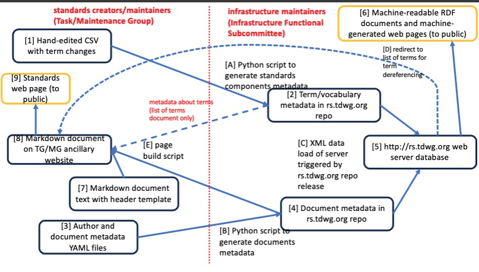
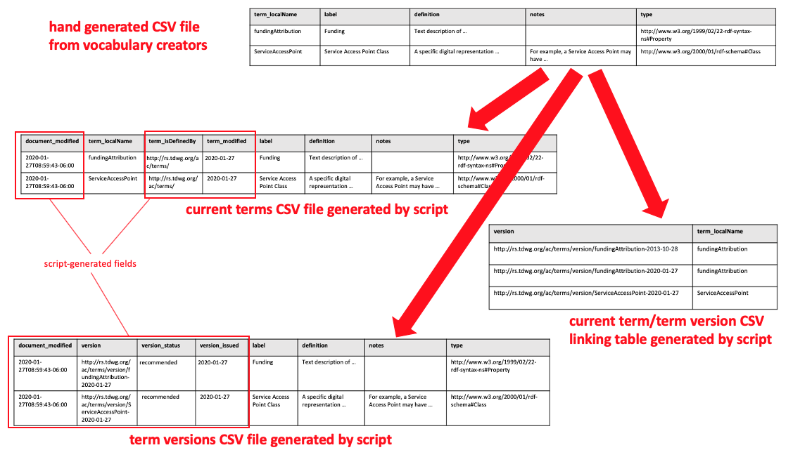
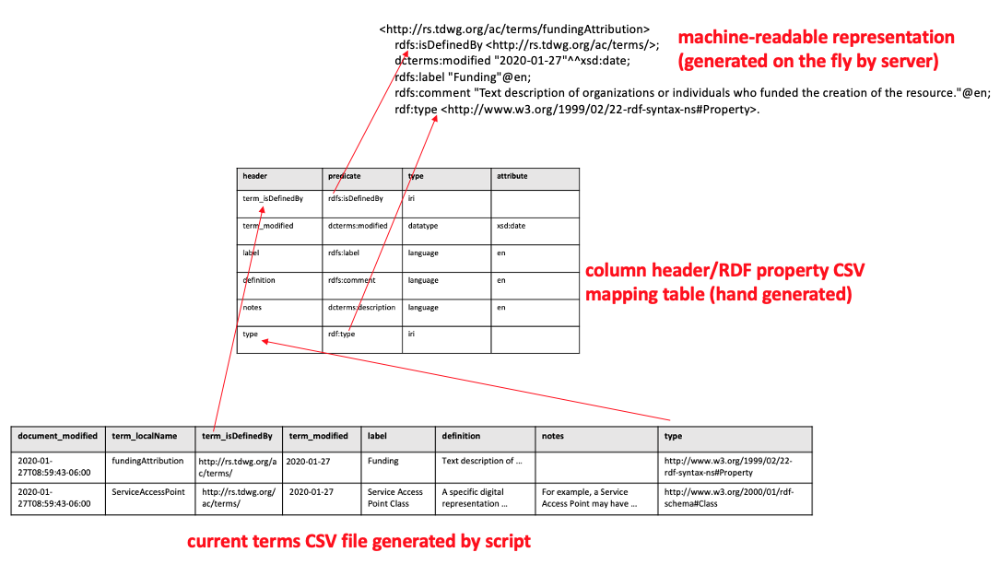
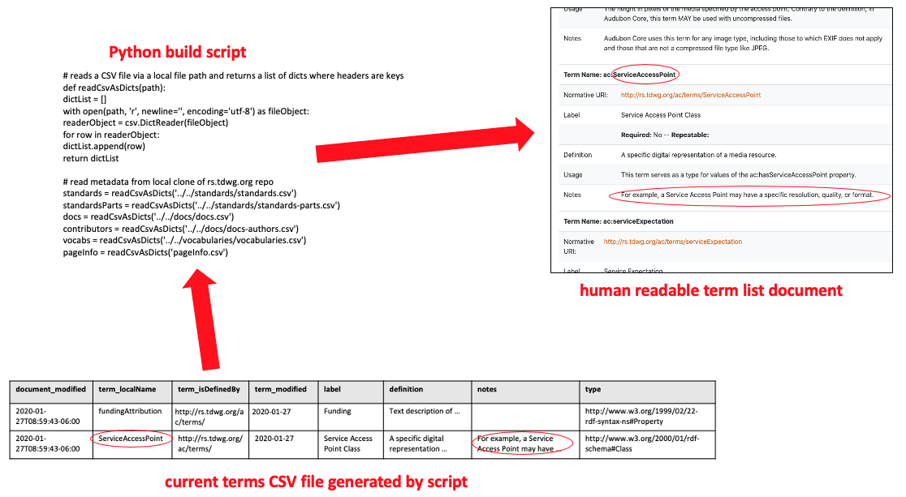
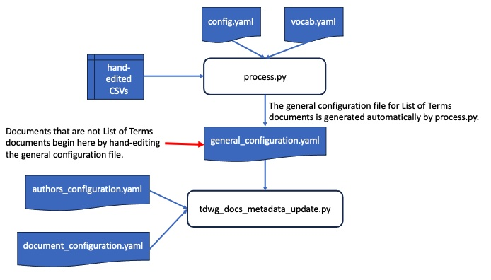

# Processing a vocabulary spreadsheet

**Title:** Processing a vocabulary spreadsheet

**Date Modified:** 2025-08-24

**Part of TDWG Standard:** Not part of any standard

**Abstract:** Once vocabulary developers have defined terms using a spreadsheet, the data in that spreadsheet can be processed into other forms used to generate human and machine readable representations of the data in the spreadsheet. This document provides information about how to use scripts to generate those representations.

**Contributors:** Steve Baskauf (TDWG Technical Architecture Group, TDWG Audubon Core Maintenance Group, TDWG Darwin Core Maintenance Group)

# Table of Contents

[1 Introduction](#1-introduction)

[2 Using this document](#2-using-this-document)

[3 Detailed workflow steps](#3-detailed-workflow-steps)

[4 Build script for a human readable List of Terms document](#4-build-script-for-a-human-readable-list-of-terms-document)

[5 Generating JSON-LD for controlled vocabularies](#5-generating-json-ld-for-controlled-vocabularies)

[6 Reference](#6-reference)

# 1 Introduction

## 1.1 RFC 2119 statement

The key words "MUST", "MUST NOT", "REQUIRED", "SHALL", "SHALL NOT", "SHOULD", "SHOULD NOT", "RECOMMENDED",  "MAY", and "OPTIONAL" in this document are to be interpreted as described in [RFC 2119](https://tools.ietf.org/html/rfc2119).

Use of 2119 keywords is not an indication that compliance is required by any TDWG standard. Rather, it is an indication that the associated software will not function as designed if the user does not comply with the requirements of this document.

## 1.2 Audience

This document is intended for those who are responsible for maintaining the TDWG infrastructure. It can also be used by anyone who is developing a vocabulary and wants to generate draft term list documents from a hand-generated CSV file.

## 1.3 Background

The [TDWG Standards Documentation Specification](http://rs.tdwg.org/sds/doc/specification/) (SDS) indicates that all human and machine readable representations of vocabulary components should provide the same data. That can be achieved by using a script to generate those representations from a common data source: CSV files generated from a [basic hand-generated CSV file created by the vocabulary developers](create-vocabulary.md). The process is similar regardless of whether it is a new vocabulary or if modifications are being made to an existing vocabulary. NOTE: term deprecations cannot be carried out using this workflow and they require a number of special steps. See the [notes at the start of the detailed Jupyter notebook](process_rs_tdwg_org.ipynb) for specific steps that are necessary for term deprecations.

The diagram above shows a high-level view of how the hand-edited CSV file is combined with author and document metadata (in the form of a YAML file provided by the vocabulary maintainers) to generate machine-readable metadata (in the form of RDF) and a human-readable List of Terms document. Ideally, this process involves a back-and-forth between the vocabulary maintainers (e.g. a Maintenance Group) and those who maintain the TDWG infrastructure (in particular, the rs.tdwg.or GitHub repository). The maintainers provide the raw data in the form of the hand-edited CSV and YAML files, which are then processed by script to generate the necessary authoritative files in the rs.tdwg.or repo. These authoritative files can then be used by the maintainers to generate (by script) an updated List of Terms document on their ancillary website. 

The same workflow can be used to generate draft documents using a branch or fork of the rs.tdwg.org repo prior to final ratification of term changes. In that case the maintainers can simulate the entire process without merging the changes into the `master` branch of rs.tdwg.org .

The following diagrams show some of the details of the steps shown in the overview above.

A Python script ("A" in the overview diagram) uses the data present in the hand-generated CSV files to generate several CSV files ("2" in the overview diagram) that contain all of the metadata required by the SDS. The data are used to generate specific term versions and to update the current terms by automatically adding some fields that are generated by the script. The script also links the versions to the current terms in a join table.

Data in the generated current terms CSV file is used with a mapping table to generate machine-readable metadata ("6" in the overview diagram) about the terms. The mapping table is hand-edited as necessary when the vocabulary is first created and relates the header names in the current terms CSV file to the abbreviated property IRIs used in the machine readable representation.

### 1.3.1 Human readable document listing terms

The current terms CSV file ("2" in the overview diagram) and metadata YAML files ("3" in the overview diagram) can also be used along with a Python build script ("E" in the diagram above) to create a human readable document listing terms and their metadata (a "List of Terms" document; "8" in the diagram above). The List of Terms build script is managed by the Maintenance Group, so the details of its operation vary by vocabulary. However, to ensure that the principle that metadata in any serialization is the same, the script MUST draw from the authoritative CSV files in rs.tdwg.org to ensure that is the case. 

**Technical note:** There is a distinction between this document listing terms and a "term list" document. *Term list* is a technical term defined in [section 3.3.3 of the SDS](http://rs.tdwg.org/sds/doc/specification/) denoting a list of terms incorporated into a vocabulary that share a common namespace. Therefore, a "term list" document is a document that describes all of the terms included in a term list. The document listing terms that is described here may or may not be the same as a "term list" document since it can include terms from a single namespace or terms from an entire vocabulary that consists of multiple term lists. Documents listing terms in a vocabulary are typically called "List of Terms" documents.

During the initial vocabulary development process, a List of Terms build script can be used to generate drafts for review. Re-running the build script will cause changes or corrections made to the hand generated CSV file to be reflected in a revised document listing terms. Typically, the drafts are managed in a branch, since making the changes to the "master" branch could potentially make the drafts go "live".

### 1.3.2 Redirection for human-readable term metadata during content negotiation

For term IRIs, redirection during content-negotiation for machine-readable representations is handled automatically by the server, since those representations are generated directly from the metadata stored in the rs.tdwg.org repo. However, the human-readable representations redirect to fragment identifiers in List of Terms documents. For currently maintained vocabularies, these are usually GitHub Pages-generated web pages whose actual page URLs do not correspond to the term IRIs. Correct redirection is controlled by the redirect URL in the [`redirects.csv` file](https://github.com/tdwg/rs.tdwg.org/blob/master/html/redirects.csv) in the `html` directory of the `rs.tdwg.org`. The `process.py` processing script will update this table automatically, but vocabulary maintainers MUST make sure that the fragment identifiers in the List of Terms documents follow a pattern that can be specified in the `config.yaml` file.

# 2 Using this document

Since this document is intended for use by those who are responsible for maintaining the TDWG infrastructure, it is assumed that the user has a basic understanding of the TDWG infrastructure and the standards that are maintained by TDWG. 

## 2.1 Skills required

To carry out the process described in this document, you need to know how:
- to use Git and GitHub. The simplest way to carry out the necessary operations is to download the [GitHub Desktop client](https://desktop.github.com/). An introduction to Git and GitHub is [here](http://vanderbi.lt/github).
- to edit a YAML configuration file using a text editor.
- to run a Python script, and have Python installed on your local computer.

## 2.2 Required inputs

After cloning the rs.tdwg.org repository to your local drive, you will have a copy of two Python scripts:
- `tdwg_docs_metadata_update.py` used to update the metadata about human-readable documents.
- `process.py` used to process hand-generated vocabulary metadata CSV files (vocabularies/Lits of Terms only).

Prior to beginning the processing steps, several data files are required. These include the underlying metadata and some configuration files:

- an `authors_configuration.yaml` file that contains metadata about the authors of the document. 
- a `document_configuration.yaml` file that contains metadata about the document.
- a separate hand-generated CSV file for each namespace to be processed (vocabularies/List of Terms only). Each hand generated file represents a term list. The term lists MUST be part of the same vocabulary. Processing of multiple vocabularies requires separate processing runs.
- a `config.yaml` file that contains the configuration settings for the processing script (vocabularies/List of Terms only). This file is used to specify the location of the hand-generated CSV files and to specify how the processing script should process the data in those files. The configuration file also contains some term list-level metadata. 
- a `vocab.yaml` file that contains metadata about the vocabulary and standard that include the term changes (vocabularies/List of Terms only).

An additional file, `general_configuration.yaml`, is required for updating the metadata about human-readable documents. It is edited automatically in the case of List of Terms documents for vocabularies processed by the process.py script, but must be edited manually for other documents.

# 3 Detailed workflow steps

1. Clone the [rs.tdwg.org](https://github.com/tdwg/rs.tdwg.org) repository to your local drive.
2. Create a new branch of the repository. If you are creating or updating a human-readable document that is not a List of Terms document, you should skip to step 10. NOTE: the `process.py` and `tdwg_docs_metadata_update.py` scripts run entirely on local copies of the files, so it does not matter whether you push changes to GitHub after making commits before running the scripts. However, 
3. Place the hand-generated namespace CSV files in some subdirectory of [the `process` directory](https://github.com/tdwg/rs.tdwg.org/tree/master/process) of the repository. There are existing directories called [`ac-revisions` for Audiovisual Core](https://github.com/tdwg/rs.tdwg.org/tree/master/process/ac-revisions) and [`dwc-revisions` for Darwin Core](https://github.com/tdwg/rs.tdwg.org/tree/master/process/dwc-revisions). There are [example spreadsheets](https://github.com/tdwg/rs.tdwg.org/tree/master/process/example-spreadsheets) that can be used as an example. For more information, see the [instructions for creating a vocabulary](https://github.com/tdwg/rs.tdwg.org/blob/master/process/create-vocabulary.md#user-content-3-details-and-examples). NOTE: when updating terms in an existing vocabulary, it is best to copy cells from the existing primary metadata CSV file (the one that shares the name of the directory) to avoid typographical errors that would result in unwanted changes to the term metadata.
4. Open the [`config.yaml` file](https://github.com/tdwg/rs.tdwg.org/blob/master/process/config.yaml) from the `process` directory in a text editor. The existing file will have values from previous updates, which you can edit and use as a template. Alternatively, you can look for a similar configuration file from an earlier update that was stored in the `xx-revisions` directory for the vocabulary you are updating (e.g. `dwc-revisions`). 
5. Enter the general configuration settings and settings for each of the namespaces to be updated. There are detailed comments in the YAML file to guide you. You can also look in recent existing revisions files for examples if you are unsure about how to edit the file. It is standard practice to save that edited file along with the hand-generated CSV file in an appropriate subdirectory for future use.
6. The [`vocab.yaml` file](https://github.com/tdwg/rs.tdwg.org/blob/master/process/vocab.yaml) in the `process` directory contains metadata about the vocabulary and standard that include the term changes. Unless a vocabulary is new, this file will generally not need to be changed. A copy saved in one of the existing revision directories can be reused without modification. However, if changes are made to metadata fields in this file for existing vocabularies or standards, such as the label or description, those changes will be reflected in the metadata for the vocabulary or standard. So its best to reuse the most recent copy. If a new vocabulary (or standard) is being created, an existing `vocab.yaml` file will need to be edited to reflect the metadata about the new vocabulary (or standard).
7. Before running the [`process.py` script](https://github.com/tdwg/rs.tdwg.org/blob/master/process/process.py), in the `process` directory, make a commit that you can go back to if things don't go as anticipated. Run the script. NOTE: part of the script will update a record determining how term IRI redirects are handled during content negotiation in the [`redirects.csv` file](https://github.com/tdwg/rs.tdwg.org/blob/master/html/redirects.csv) in the `html` directory of the `rs.tdwg.org` repository. See Section 1.3.2 for details.
8. After running the script, carefully examine the diffs for the changed files to make sure that they make sense. This can easily be done using the GitHub Desktop client. If something did not go as planned, discard the changes to go back to the previous commit.  If really bad things happen and you want to start over, commit the changes, then delete the branch you created. Otherwise, commit the changes. You SHOULD also store a copy of the `config.yaml` and `vocab.yaml` files in the same directory as the hand-generated CSV file for future reference.
9. If you are creating a new vocabulary and the hand-edited CSV file contains columns for additional properties beyond those required by the Standards Documentation Specification, you MUST manually edit the column header mapping file. This is discussed in detail in section 3.1 below. 
10. The metadata about human-readable documents, including a List of Terms document must be added or updated using the [`tdwg_docs_metadata_update.py` script](https://github.com/tdwg/rs.tdwg.org/blob/master/process/document_metadata_processing/tdwg_docs_metadata_update.py) in the `document_metadata_processing` directory. If there are more than one documents to be updated, the script MUST be run separately for each one. There are three YAML configuration files (described below) required to run the script. See the comments in each one for details. 
11. Required configuration variables are in the [file `general_configuration.yaml`](https://github.com/tdwg/rs.tdwg.org/blob/master/process/document_metadata_processing/general_configuration.yaml), which MUST be in the same directory as the script (the `document_metadata_processing` directory). If List of Terms document metadata is being updated following a vocabulary update, the data in this file will be generated automatically. For all other documents, this file MUST be updated manually. 
12. The two other configuration files that are required for the script to run must be in subfolders of the `document_metadata_processing` directory that correspond to the pattern of the document's premanent IRI. The fields in the `authors_configuration.yaml` file ([example](https://github.com/tdwg/rs.tdwg.org/blob/master/process/document_metadata_processing/dwc_doc_eco/authors_configuration.yaml)) will be used to update the data table. All fields are REQUIRED except `affiliation` and `affiliation_uri`. Fields in the `document_configuration.yaml` file ([example](https://github.com/tdwg/rs.tdwg.org/blob/master/process/document_metadata_processing/dwc_doc_eco/document_configuration.yaml)) will be used to update the document metadata. 
13. Run the script. After examining the diffs to make sure everything is OK, commit the changes.  **IMPORTANT NOTE** As of 2024-03-03, the script will not create a new standard record. This is only significant if the first resource added to a standard is NOT a List of Terms document. If there are additional documents for a new standard that are not List of Terms documents, the List of Terms document should be created first. If the standard does not include a List of Terms document, new records in the standards tables will need to be created manually.
14. As you have generated all of the necessary metadata now, you need to push the commits to GitHub if you have not already done so. At this point, you have the option to merge the branch to master. If ratification has not yet occurred, you should leave the data in a branch. The main implication is that if a human-readable term list documents is generated, the build script must be set to look at the working branch if not merged. If ratification has occurred, then it is appropriate to merge the branch to master. Once the merge to master has occurred, term dereferencing for machine-readable metadata can be tested using the rs-test.tdwg.org server. For example, if the term `http://rs.tdwg.org/eco/terms/protocolNames` was changed (added or modified), the URL http://rs-test.tdwg.org/eco/terms/protocolNames.rdf should return RDF/XML that includes the changes. Note: there is a time lag between when the merge is made and when the changes are live on the server. The GBIF Jenkins bot can be used to monitor the build jobs. Don't forget to delete the branch after merging it to master.
15. After testing to make sure that URL behavior is appropriate, a new release of the rs.tdwg.org repository should be made. That triggers deployment to the production http://rs.tdwg.org server and the changes should be "live". As with the test URL, there is a time lag between when the release is made and when the changes are live on the server. Also note that there is front-end caching on the server. So it is possible that changes will not be immediately visible. There is a flush cache operation that can be done to make the cache reflect the current state of the server. See Matt Blissett for details. Otherwise, I think the cache is set to expire after 30 days.
16. Regardless of whether the working branch was merged, you can run a script to generate a human readable document listing terms and their metadata (See section 4 below). Revisions made based on drafts of this document should be made to the hand-generated CSV file. That revised CSV file should then be reprocessed in a new branch and the human readable document regenerated. This process can be repeated until ratification is complete.

## 3.1 Modifying the column header mapping file

Because the SDS requires particular properties to be included in term metadata, if the template hand-generated CSV file is used without editing the column headers, a template column header mapping file can be used as well. The column header mapping file only needs to be modified if additional property columns are added to the template CSV file. This may happen if specialty properties are added to the required properties.

Controlled vocabularies contain one or more additional properties that are not found in vocabularies that define properties and classes. That includes the controlled value string and may also include a property to indicate that a value has a `broader` relationship to another concept. So controlled vocabularies should use one of the template column header mapping files designed for controlled vocabularies. Setting the value of `vocab_type` in the configuration section determines whether the mapping template includes mappings for these extra term columns or not. See section 2.1.1 for details.

If additional property columns were added to the hand-generated CSV file, the mapping file in the current terms directory for that term list (i.e. the directory created having the name set as the value of `database` in the configuration section) must be manually edited. The name of the mapping file ends in `-mappings.csv`. 

The order of rows in the mapping file does not matter. The first column (`header`) contains the name of the column header in the hand-generated CSV file. The second column (`predicate`) contains the abbreviated IRI (also known as [CURIE](https://www.w3.org/TR/curie/) or [QName](https://www.w3.org/2001/tag/doc/qnameids)). If the namespace abbreviation of an added row is different from others already present in this column, check the `namespace.csv` file in the same directory to make sure that the abbreviation is already listed. If not, add it to that list of namespace abbreviations and IRIs. The third column, which describes the type of the value in the column, MUST have one of the following strings as its value: `iri`, `language`, `datatype`, or `plain`. For language-tagged strings, the `attribute` column contains the ISO 639-1 language code used in the tag. For strings having a `datatype`, the `attribute` column contains the abbreviated IRI for the datatype. If the column in the CSV file contains an unabbreviated full IRI, there is no value in the `value` column of the mapping table. If the column in the CSV contains the local name part of the IRI, the `value` column contains full namespace IRI to be prepended to the value from column in the CSV. 

It is also possible to generate a fixed value for all rows in the CSV table. See [this page](https://github.com/baskaufs/guid-o-matic/blob/master/use.md#recording-the-column-mappings-from--the-metadata-table-to-rdf-triples) for more details on the format of the mapping file. 

## 3.2 Legacy notebooks and term deprecations

There are two Python scripts in Jupyter notebooks that were used to develop the script and formerly used to do the processing. They are no longer maintained, but contain a lot of comments that might help in understanding what the script does. They may also be useable for term deprecations. They are:

1. The [simplified processing script](simplified_process_rs_tdwg_org.ipynb) presupposes no knowledge of Python and will work for most term additions and changes in existing standards and for creating simple vocabularies or term lists, including controlled vocabularies. **You MUST NOT use this script for term deprecations.**
2. Because this script is not designed for use by the general public, it has limited error trapping. In cases where results are not as expected, or where unusual changes such as term deprecations are required, the [full processing script](process_rs_tdwg_org.ipynb) SHOULD be used. This script contains the same code as the simplified script, but separates the code among more cells and provides more feedback in the form of print statements. **Note on 2024-03-01: Since this script was written, the processing script has been significantly modified. You should not assume that the full processing script notebook is usable without modification.**

We really should not be deprecating terms anyway, so there should be only rare cases where using the full processing script is necessary.

# 4 Build script for a human readable List of Terms document

A document listing terms and their metadata (a "List of Terms" document) is a Markdown document consisting of two or more parts. The first part is a hand-edited template file that contains the introductory material (header section, introduction, RFC 2119 keywords section, etc.). The second part is created by a script that generates the actual list of terms from the current terms files for term lists that are included in the listing. The script is relatively simple if all terms are found in a single term list. It is more complex if the vocabulary includes terms from several term lists or if the terms are categorized. There are two example build scripts that can be modified by a Python programmer if modifications are needed to make the term list document conform to the idiosyncrasies of a given vocabulary.

## 4.1 Building a simple term list

The notebook `build-page-simple.ipynb` in the `process/page_build_scripts` directory of the rs.tdwg.org repository has an example set up for a controlled vocabulary with hierarchy. That directory also has a template Markdown file for the introductory section that can be modified as necessary.

## 4.2 Categorizing terms

It is reasonable to include the few terms of a simple vocabulary in a single section. However, documents listing the terms of larger and more complicated vocabularies may need to be organized into categories to make it easier to locate related terms. This approach was first used with Darwin Core and has also been adopted by Audubon Core. 

The key to organizing the terms in this way is by using the property `tdwgutility:organizedInClass` where the value is a class under which the subject is organized. NOTE: the local name of this property should not mislead users to think that grouping property terms in this way indicates that the grouped properties have been declared to have the organizing class as a domain. TDWG-minted terms SHOULD NOT have ranges or domains as part of their basic metadata.

In many cases, the organizing class will be a well-known class previously defined by TDWG or some other organization. Examples in Darwin Core are `dwc:Occurrence` and `dcterms:Location`. However, it is also possible to create a "convenience" class within the `tdwgutility:` namespace solely for the purpose of organizing related terms. For example, Audubon Core uses the class `tdwgutility:ResourceCreation` to group property terms related to the creation of multimedia resources. Terms in the `tdwgutility:` namespace are not generally governed by any standard, so organizational class terms can be added as necessary without going through any official change process.

### 4.2.1 Using categories

In order to use categories, edit the configuration section of the build script so that the value of `organized_in_categories` is `True`. Then create Python lists containing corresponding values for `display_order`, `display_labels`, `display_commnets`, and `display_id`. When the script builds the page, it will use these data to organize the terms and create appropriate section headings and notes for the categories. See the notebook `build-page-categories.ipynb` in the `process/page_build_scripts` directory of the rs.tdwg.org repository for an example.

# 5 Generating JSON-LD for controlled vocabularies

In order to make controlled vocabularies as widely available as possible, multi-lingual translations of the term labels and definitions should be made available in as many languages as possible. A Python script (build-json-ld.ipynb) to generate JSON-LD is avaialable in the `cv_json_ld` directory. It can be run from any location, so maintenance groups should use it to generate JSON-LD representations of their controlled vocabularies on their own sites. This JSON-LD can then be used by developers to create multilingual tools to make it easier for users to select the right concept and acquire the controlled value string or IRI associated with that concept.

Because the JSON-LD can easily be ingested, it can also be used to build multilingual web applications. Some Javascript code and an HTML file for a simple web page is also available in the directory. To see the page in action, visit [this page](https://heardlibrary.github.io/digital-scholarship/lod/json_ld_test/display-cv.html). NOTE on 2024-03-04, the management of translations documentation is still being worked out.

# 6 Reference

## 6.1 Standards hierarchy

The TDWG standards hierarchy organizes resources at four major levels: standards, vocabularies, term lists, and terms. The hierarchy is shown in the diagram below. 

Ratification of a term addition or change triggers new versions at all of the higher levels in the standards hierarchy. New term versions trigger new term list versions. New term list versions trigger new vocabulary versions and new vocabulary versions trigger new standards versions. For more information about versioning of TDWG standards, see [Section 2.3 of the TDWG Standards Documentation Specification](http://rs.tdwg.org/sds/doc/specification/).

## 6.2 Term versions

Each current term is related to at least one term version. If a current term is new, its record is created and the last-modified date is set to be the same as the created date. A dated version is also created for the current term, with an issued date that is the same as the last-modified date of the current term.

Each time a term's metadata is revised, a new version is created. The term version IRI is formed by appending the date of issue to the term local name. A `hasVersion` relationship is created between the term and its version, and the new version has a `replaces` relationship with the previous version. The metadata defining these relationships are generated by the processing script. Other properties such as the definition, usage, and notes are copied from the hand-generated CSV file edited by the creators/maintainers.

## 6.3 Assignment of term versions to a new term list version

A term list is a group of related terms that share the same namespace part of their IRI. As with all TDWG resources, term lists also have versions. When a term is changed or added, the new term version is added to a new version of the term list (replacing any older version if necessary). If a term is new, it is also added to the existing term list. 

## 6.4 Proliferation of new versions up the hierarchy

A new term list version is updated in its parent vocabulary version and a new vocabulary version is updated in its parent standard version. A term list is only added to its parent vocabulary if it represents terms in a namespace that is not already represented in the vocabulary. Similarly, vocabularies are only added to a standard if they are new, although new versions of both the vocabulary and standard are recorded.