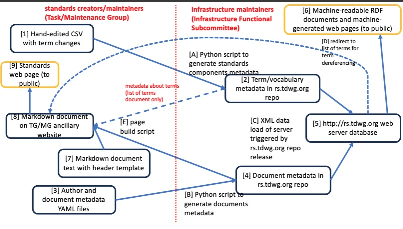
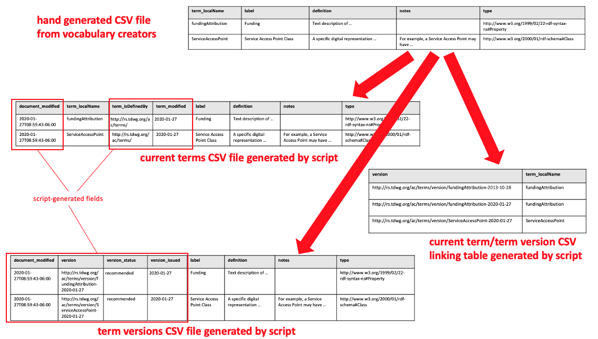
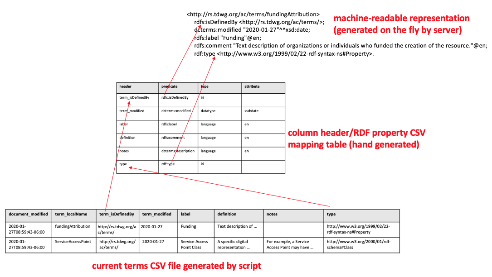
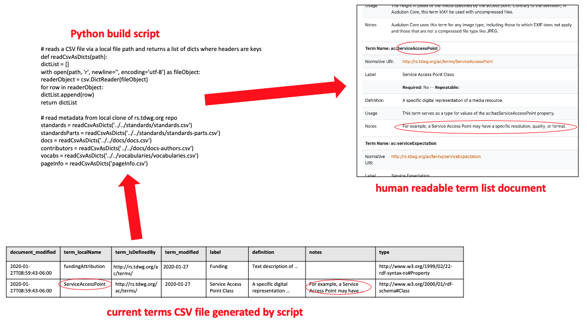
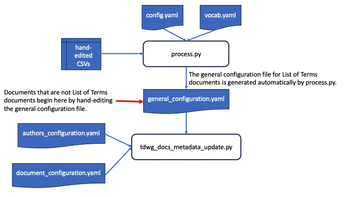

# Processing a vocabulary spreadsheet

**Title:** Processing a vocabulary spreadsheet

**Date Modified:** 2026-03-17

**Part of TDWG Standard:** Not part of any standard

**Abstract:** Once vocabulary developers have defined terms using a spreadsheet, the data in that spreadsheet can be processed into other forms used to generate human and machine readable representations of the data in the spreadsheet. This document provides information about how to use scripts to generate those representations.

**Contributors:** Steve Baskauf (TDWG Technical Architecture Group, TDWG Audiovisual Core Maintenance Group, TDWG Darwin Core Maintenance Group)

# Table of Contents

[1 Introduction](#1-introduction)

[2 Using this document](#2-using-this-document)

[3 Detailed workflow steps](#3-detailed-workflow-steps)

[4 Build script for a human readable List of Terms document](#4-build-script-for-a-human-readable-list-of-terms-document)

[5 Generating JSON-LD for controlled vocabularies](#5-generating-json-ld-for-controlled-vocabularies)

[6 Reference](#6-reference)

# 1 Introduction

## 1.1 RFC 2119 statement

The key words “MUST”, “MUST NOT”, “REQUIRED”, “SHALL”, “SHALL NOT”, “SHOULD”, “SHOULD NOT”, “RECOMMENDED”, “MAY”, and “OPTIONAL” in this document are to be interpreted as described in [BCP 14](https://www.rfc-editor.org/info/bcp14) [[RFC 2119]](https://datatracker.ietf.org/doc/html/rfc2119) and [[RFC 8174]](https://datatracker.ietf.org/doc/html/rfc8174) when, and only when, they appear in all capitals, as shown here.

Use of 2119 keywords is not an indication that compliance is required by any TDWG standard. Rather, it is an indication that the associated software will not function as designed if the user does not comply with the requirements of this document.

## 1.2 Audience

This document is intended for those who are responsible for maintaining the TDWG infrastructure. It can also be used by anyone who is developing a vocabulary and wants to generate draft term list documents from a hand-generated CSV file.

## 1.3 Background

The [TDWG Standards Documentation Specification](http://rs.tdwg.org/sds/doc/specification/) (SDS) indicates that all human and machine readable representations of vocabulary components should provide the same data. That can be achieved by using a script to generate those representations from common data sources: CSV files generated from a [basic hand-generated CSV file created by the vocabulary developers](create-vocabulary.md) and YAML files containing metadata about the components. The process is similar regardless of whether it is a new vocabulary or if modifications are being made to an existing vocabulary. 

The majority of this document is focused on the process of generating the underlying data used to construct List of Terms documents. However, standards can also include documents other than Lists of Terms e.g., Darwin Core includes Text, XML, and RDF guides. Although these documents do not contain lists of terms, they do have basic document-level metadata that needs to be managed and made available when the document IRIs are dereferenced via a request for machine-readable RDF metadata. So a subset of the detailed workflow in Section 3 (starting at step 10) needs to be used.

NOTE: term deprecations cannot be carried out using this workflow and they require a number of special steps. See the [notes at the start of the detailed Jupyter notebook](process_rs_tdwg_org.ipynb) for specific steps that are necessary for term deprecations. In general, term deprecations should be avoided unless absolutely necessary.

The diagram above shows a high-level view of how the hand-edited CSV file is combined with author and document metadata (in the form of YAML files provided by the vocabulary maintainers) to generate machine-readable metadata (in the form of RDF) and a human-readable List of Terms document. Ideally, this process involves a back-and-forth between the vocabulary maintainers (e.g. a Maintenance Group) and those who maintain the TDWG infrastructure (in particular, the rs.tdwg.or GitHub repository). The maintainers provide the raw data in the form of the hand-edited CSV and YAML files, which are then processed by script to generate the necessary authoritative files in the rs.tdwg.or repo. These authoritative files can then be used by the maintainers to generate (by script) an updated List of Terms document on their ancillary website. 

The same workflow can be used to generate draft documents using a fork of the rs.tdwg.org repo prior to final ratification of term changes. In that case the maintainers can simulate the entire process without merging the changes into the `master` branch of rs.tdwg.org . See [Section 2.3 below](https://github.com/tdwg/rs.tdwg.org/blob/master/process/process-vocabulary.md#23-generating-drafts) for details.

The following diagrams show some of the details of the steps shown in the overview above.

A Python script ("A" in the overview diagram) uses the data present in the hand-generated CSV files to generate several CSV files ("2" in the overview diagram) that contain all of the metadata required by the SDS. The data are used to generate specific term versions and to update the current terms by automatically adding some fields that are generated by the script. The script also links the versions to the current terms in a join table.

Data in the generated current terms CSV file is used with a mapping table to generate machine-readable metadata ("6" in the overview diagram) about the terms. The mapping table is hand-edited as necessary when the vocabulary is first created and relates the header names in the current terms CSV file to the abbreviated property IRIs used in the machine readable representation.

### 1.3.1 Human readable document listing terms

The current terms CSV file ("2" in the overview diagram) and metadata YAML files ("3" in the overview diagram) can also be used along with a Python build script ("E" in the diagram above) to create a human readable document listing terms and their metadata (a "List of Terms" document; "8" in the diagram above). The List of Terms build script is managed by the Maintenance Group, so the details of its operation vary by vocabulary. However, to ensure that the principle that metadata in any serialization is the same, the script MUST draw from the authoritative CSV files in rs.tdwg.org (or the appropriate current [document_configuration.yaml document configuration files](document_metadata_processing)) to ensure that is the case. 

**Technical note:** There is a distinction between this document listing terms and a "term list" document. *Term list* is a technical term defined in [section 3.3.3 of the SDS](http://rs.tdwg.org/sds/doc/specification/) denoting a list of terms incorporated into a vocabulary that share a common namespace. Therefore, a "term list" document is a document that describes all of the terms included in a term list. The document listing terms that is described here may or may not be the same as a "term list" document since it can include terms from a single namespace or terms from an entire vocabulary that consists of multiple term lists. Documents listing terms in a vocabulary are typically called "List of Terms" documents.

During the initial vocabulary development process, a List of Terms build script can be used to generate drafts for review. Re-running the build script will cause changes or corrections made to the hand generated CSV file to be reflected in a revised document listing terms. Typically, the drafts are managed in a fork of rs.tdwg.org, since the developing task grop will generally not have write access to rs.tdwg.org . See [Section 2.3 below](https://github.com/tdwg/rs.tdwg.org/blob/master/process/process-vocabulary.md#23-generating-drafts) for details.

### 1.3.2 Redirection for human-readable term metadata during content negotiation

For term IRIs, redirection during content-negotiation for machine-readable representations is handled automatically by the server, since those representations are generated directly from the metadata stored in the rs.tdwg.org repo. However, the human-readable representations redirect to fragment identifiers in List of Terms documents. For currently maintained vocabularies, these are usually GitHub Pages-generated web pages whose actual page URLs do not correspond to the term IRIs. Correct redirection is controlled by the redirect URL in the [`redirects.csv` file](https://github.com/tdwg/rs.tdwg.org/blob/master/html/redirects.csv) in the `html` directory of the `rs.tdwg.org`. The `process.py` processing script will update this table automatically using data from the appropriate `config.yaml`, file but vocabulary maintainers MUST make sure that the fragment identifiers in the List of Terms documents the generate follow a pattern that can be specified in the `config.yaml` file. 

The convention as of 2026-03-17 is to construct the fragment identifier by concatenating the namespace abbreviation + "_" + the local name. For example, the fragment identifier for `dwc:recordedBy` would be `dwc_recordedBy` (case of both namespace and local name preserved). The redirect URL would then be the actual page URL + "#" + the fragment identifier. In this example, the redirect URL for <http://rs.tdwg.org/dwc/terms/recordedBy> would be <https://dwc.tdwg.org/list/#dwc_recordedBy>. An example of the appropriate field values to specify this construction are [here](https://github.com/tdwg/rs.tdwg.org/blob/ab0fb23b55aa47b141d84e2c0f9b8ea882692e12/process/dwc-revisions/dwc-revisions-2025-07-10/config.yaml#L89-L100). The necessary tagging in the raw Markdown file to set the fragment identifier in the list of terms document is shown [here](https://github.com/tdwg/dwc/blob/237bf09e293cef0b001734d259ddcd3d43ac96b0/docs/list/index.md?plain=1#L14352).

# 2 Using this document

Since this document is intended for use by those who are responsible for maintaining the TDWG infrastructure, it is assumed that the user has a basic understanding of the TDWG infrastructure and the standards that are maintained by TDWG. 

## 2.1 Skills required

To carry out the process described in this document, you need to know how:
- to use Git and GitHub. The simplest way to carry out the necessary operations is to download the [GitHub Desktop client](https://desktop.github.com/). An introduction to Git and GitHub is [here](http://vanderbi.lt/github).
- to edit a YAML configuration file using a text editor.
- to run a Python script, and have Python installed on your local computer.

## 2.2 Required inputs

After cloning the rs.tdwg.org repository (or a fork of it) to your local drive, you will have a copy of two Python scripts:
- `tdwg_docs_metadata_update.py` used to update the metadata about human-readable documents.
- `process.py` used to process hand-generated vocabulary metadata CSV files (vocabularies/Lits of Terms only).

Prior to beginning the processing steps, several data files are required. These include the underlying metadata and some configuration files:

- an `authors_configuration.yaml` file that contains metadata about the authors of the document. 
- a `document_configuration.yaml` file that contains metadata about the document.
- a separate hand-generated CSV file for each namespace to be processed (vocabularies/List of Terms only). Each hand generated file represents a term list. The term lists MUST be part of the same vocabulary. Processing of multiple vocabularies requires separate processing runs.
- a `config.yaml` file that contains the configuration settings for the processing script (vocabularies/List of Terms only). This file is used to specify the location of the hand-generated CSV files and to specify how the processing script should process the data in those files. The configuration file also contains some term list-level metadata. 
- a `vocab.yaml` file that contains metadata about the vocabulary and standard that include the term changes (vocabularies/List of Terms only).

An additional file, `general_configuration.yaml`, is required for updating the metadata about human-readable documents. It is edited automatically in the case of List of Terms documents for vocabularies processed by the process.py script, but must be edited manually for other (non-List of Terms) documents.

## 2.3 Generating drafts

The workflow below describes how changes to terms in a vocabulary would be made by maintainers of the rs.tdwg.org repository, starting with the hand-edited source CSV files containing the changes, and ending with a new release of the rs.tdwg.org repo, resulting in the changes going "live" (i.e. term IRIs dereferencing to updated human-readable Lists of Terms or machine-readable RDF). This assumes that the changes have been finalized and ratified through the change process described in the [TDWG Vocabulary Maintenance Specification](http://rs.tdwg.org/vms/doc/specification/). 

However, it is also convenient to use the workflow to generate List of Terms drafts prior to ratification, for proofreading, soliciting comments, and presentation to the Executive Committee when the request for ratification of the changes is made. Since these drafts are likely to be made by a member of a task or maintenance group who does not have write access to the rs.tdwg.org repository, the workflow can be carried out using a fork on the member's personal repository. The List of Terms page build script (maintained by the maintenance group for the relevant vocabulary) can then be pointed at the fork as a data source when generating the draft.

The process of generating drafts is complicated by the fact that making changes to the draft requires changing the original source CSV files and going through the workflow again. Since each iteration of the workflow automatically generates new term and document versions (which are not desired when revising drafts), it is necessary to restart the process from the source CSV files without all of the derived files generated in later stages of the workflow. If commits were structured appropriately, it might be possible to revert the later commits back to the state where only the source files were present. However, this is messy and there is a simpler method. 

After forking the repository, create a new branch to contain the added source files. This branch could be called something like `ac-changes-2026-02-15-source`. Carry out steps 1 through 10 of the workflow, then make a branch of the source branch. It could be called something like `ac-changes-2026-02-15-derived`. On this new (derived) branch, carry out steps 11 through 17. After completion of step 17, the data in the derived branch (`ac-changes-2026-02-15-derived` in this example) can be used to generate the draft human-readable document for review. 

If changes need to be made, delete the derived branch and return to the branch containing only the source files (`ac-changes-2026-02-15-source` in this example). Modify the source files, make a commit, then again make a new derived branch of the source branch. Go through steps 11 through 17 on this new derived branch, and rebuild the draft human-readable document. Changes can be made by repeating this process until the draft is in its final form. This final draft (or an extract containing only the parts containing the changed terms) can be presented to the Executive Committee for review. 

Once the changes are complete and submitted to the Executive, create a pull request to move the source (not derived) branch into the master branch of the TDWG rs.tdwg.org repository. When ratification is complete, maintainers of rs.tdwg.org can then make a provisional branch, make sure that the `date_issued` field in the `config.yaml` file contains the ratification date for the changes, then carry out steps 11 through 17. After doing quality control, they can merge the provisional branch into the master. Once the derived files are all present in the master branch of rs.tdwg.org, the maintenance group can change the data source for the List of Terms build script from the fork to the source (TDWG) rs.tdwg.org repo, and rebuild the List of Terms document. When the final List of Terms document is published, the new release of rs.tdwg.org can be made so that the changes go "live".

# 3 Detailed workflow steps

**Important note:** this workflow can only update metadata related to a single vocabulary (or a single document that is not a List of Terms). For example, if you are making changes to terms in the Variant Controlled Vocabulary and in one or more namespaces in the main Audiovisual Core vocabulary, you will need to go through these steps twice (once for each vocabulary), even though both vocabularies are part of the Audiovisual Core Standard. Similarly, if you are updating metadata about the Darwin Core RDF Guide and updating terms in the Establishment Means Controlled Vocabulary, you will need to go through the steps twice (once for the vocabulary update and once for the non-List of Terms document). In this latter case, you MUST do the workflow for the vocabulary update before the workflow for update of the non-List of Terms document in order to generate a new version of the standard. As of 2024-03-03, a new standard record is only created by the `process.py` script. The `tdwg_docs_metadata_update.py` script assumes that a new version of the standard already exists (as is typically the case when that script is run after `process.py` to generate a List of Terms). In the edge case where the only update to the standard is a non-List of Terms document, or if the standard does not include a List of Terms document (e.g., the Vocabulary Maintenance Standard), new records in the standards and standards-versions tables will need to be created manually prior to running the document metadata update script.

1. If you are not a maintainer of rs.tdwg.org, you will need to first fork the [rs.tdwg.org](https://github.com/tdwg/rs.tdwg.org) repository to your account so that you will have write access for the changes you make. Clone the  forked repository to your local drive. 
2. Create a new branch of the repository. A name pattern like `ac-changes-2026-02-15-source` can help you to keep track of the branch. NOTE: the `process.py` and `tdwg_docs_metadata_update.py` scripts run entirely on local copies of the files, so it does not matter whether you push changes to GitHub after making commits before running the scripts. If you are creating or updating a human-readable document that is not a List of Terms document, you should skip to step 7. 
3. Place the hand-generated namespace CSV files in some subdirectory of [the `process` directory](https://github.com/tdwg/rs.tdwg.org/tree/master/process) of the repository. There are existing directories called [`ac-revisions` for Audiovisual Core](https://github.com/tdwg/rs.tdwg.org/tree/master/process/ac-revisions) and [`dwc-revisions` for Darwin Core](https://github.com/tdwg/rs.tdwg.org/tree/master/process/dwc-revisions). There are [example spreadsheets](https://github.com/tdwg/rs.tdwg.org/tree/master/process/example-spreadsheets) that can be used as an example. For more information, see the [instructions for creating a vocabulary](https://github.com/tdwg/rs.tdwg.org/blob/master/process/create-vocabulary.md#user-content-3-details-and-examples). However, unless you are creating a new vocabulary, it's best to start with a hand-generated CSV from a previous revision and delete the data rows so that you have all of the correct column headers. NOTE: when updating terms in an existing vocabulary, it is best to copy cells from the existing primary metadata CSV file (the one that shares the name of the directory, e.g. `audubon.csv` in the `audubon` directory) to avoid typographical errors that would result in unwanted changes fields of the term metadata that are not being changed. Not all columns in the primary metadata CSV files are present in the hand-generated CSV files (only `term_localName` and columns from the `label` column on). So you cannot just copy the entire row. 
4. If you are creating a new vocabulary, open the [`config.yaml` file](https://github.com/tdwg/rs.tdwg.org/blob/master/process/config.yaml) from the `process` directory in a text editor. The existing file will have values from a previous update, which you can edit and use as a template. If you are updating an existing vocabulary, you can look for a configuration file from an recent update that was stored in the `xx-revisions` directory for the vocabulary you are updating (e.g. `dwc-revisions`), and modify the existing values as necessary. NOTE: in cases where vocabularies have not been updated for a long time, the `xx-revisions` directory may not have a `config.yaml` file that has all of the up-to-date fields. In that case, use the one in the `process` directory as a template.
5. Enter the general configuration settings and settings for each of the namespaces to be updated. There are detailed comments in the YAML file to guide you. You can also look in recent existing revisions files for examples if you are unsure about how to edit the file. It is standard practice to save that edited file along with the hand-generated CSV file in an appropriate subdirectory for future use. NOTE: vocabularies that contain terms from multiple namespaces (e.g., Audiovisual Core, Darwin Core, and Latimer Core) may not always contain updates in every namespace. So you may need to add or remove namespace settings so that the `config.yaml` file that you are using contains metadata for only the namespaces for terms that are being changed.
6. The [`vocab.yaml` file](https://github.com/tdwg/rs.tdwg.org/blob/master/process/vocab.yaml) in the `process` directory contains metadata about the vocabulary and standard that include the term changes. Unless a vocabulary is new, this file will generally not need to be changed. A copy saved in one of the existing revision directories can be reused without modification. However, if changes are made to metadata fields in this file for existing vocabularies or standards, such as the label or description, those changes will be reflected in the metadata for the vocabulary or standard. So its best to reuse the most recent copy. If a new vocabulary (or standard) is being created, an existing `vocab.yaml` file will need to be edited to reflect the metadata about the new vocabulary (or standard). You should also save a copy of the `vocab.yaml` file that you used along with the `config.yaml` file and hand-generated CSV files for reference in future updates.
7. There are three required YAML configuration files that contain information about the document (often a List of Terms) that will be generated from the updated metadata. Configuration variables needed for updating the document metadata are in the [file `general_configuration.yaml`](https://github.com/tdwg/rs.tdwg.org/blob/master/process/document_metadata_processing/general_configuration.yaml), which MUST be in the same directory (the `document_metadata_processing` directory) as the script that updates the document metadata ([tdwg_docs_metadata_update.py](https://github.com/tdwg/rs.tdwg.org/blob/master/process/document_metadata_processing/tdwg_docs_metadata_update.py)). If List of Terms document metadata is being updated following a vocabulary update, the data in this file will be generated automatically and the file does not need to be edited. For all other documents, this file MUST be updated manually. 
8. The two other configuration files that are required for the document metadata script to run must be in subfolders of the `document_metadata_processing` directory that correspond to the pattern of the document's premanent IRI. The fields in the `authors_configuration.yaml` file ([example](https://github.com/tdwg/rs.tdwg.org/blob/master/process/document_metadata_processing/dwc_doc_eco/authors_configuration.yaml)) will be used to update the authors data tables ([docs-authors.csv](https://github.com/tdwg/rs.tdwg.org/blob/master/docs/docs-authors.csv) and [docs-roles.csv](https://github.com/tdwg/rs.tdwg.org/blob/master/docs-roles/docs-roles.csv)). All fields are REQUIRED except `affiliation` and `affiliation_uri`. Fields in the `document_configuration.yaml` file ([example](https://github.com/tdwg/rs.tdwg.org/blob/master/process/document_metadata_processing/dwc_doc_eco/document_configuration.yaml)) will be used to update the document metadata ([docs.csv](https://github.com/tdwg/rs.tdwg.org/blob/master/docs/docs.csv) and [docs-formats.csv](https://github.com/tdwg/rs.tdwg.org/blob/master/docs/docs.csv)). If there are existing YAML files for the document, you only need to edit them if there are changes to the primary metadata of the document (authors, description, etc.). Changes to the mutable document metadata (dated versions, issued date, updated citation, etc.) will automatically be generated by the script based on the contents of the `general_configuration.yaml` file. 
9. If you are creating a new vocabulary and the hand-edited CSV file contains columns for additional properties beyond those required by the Standards Documentation Specification, you MUST manually edit the column header mapping file. This is discussed in detail in section 3.1 below. 
10. At this point, all of the source data required by the scripts should be in place. Make a commit. 
11. In the event that the source data needs to be revised, it is convenient to be able to return to the commit you just made without reverting all of the subsequent changes made by the scripts as they generate derived data. The simplest way to do this is to make a new branch from the working branch that contains the source data. A name pattern like `ac-changes-2026-02-15-derived` will help differentiate the new branch from the one containing only the source data. If you are updating the metadata for a document that is **not** a List of Terms document, go to step 14 to update only document metadata.
12. Run the [`process.py` script](https://github.com/tdwg/rs.tdwg.org/blob/master/process/process.py) found in the process directory of your cloned rs.tdwg.org repo. NOTE: part of the script will update a record determining how term IRI redirects are handled during content negotiation in the [`redirects.csv` file](https://github.com/tdwg/rs.tdwg.org/blob/master/html/redirects.csv) in the `html` directory of the `rs.tdwg.org` repository. See Section 1.3.2 for details.
13. After running the script, carefully examine the diffs for the changed files to make sure that they make sense. This can easily be done using the GitHub Desktop client. If something did not go as planned, try to determine what was wrong with the source data that caused the problem. To troubleshoot, you can discard the changes to go back to the previous commit, then correct any errors in the source data to see if that fixes the problem.  Once you have finished troubleshooting and know how the source data needs to be modified, switch to the source branch that you created in step 2 and edit the source data as necessary. Commit the changes. Then delete the derived branch you created, and create a new derived branch from your source branch. If things went smoothly after running the script, then just commit the changes. 
14. Run the [`tdwg_docs_metadata_update.py` script](https://github.com/tdwg/rs.tdwg.org/blob/master/process/document_metadata_processing/tdwg_docs_metadata_update.py) in the `document_metadata_processing` directory to add or update metadata about the human-readable document.  
15. Examine the diffs to make sure everything makes sense. If so commit the changes. If not, then dischard the changes, try editing the source files to determine the cause, and re-run the script. If the changes you made fixed the problem, then you will need to go back to the source branch, edit the source files as necessary, and commit. Delete the derived branch, then create a new one from the source branch and repeat steps 12-15.  
16. As you have generated all of the necessary metadata now, you need to push the commits to GitHub if you have not already done so. If your goal is to generate a draft List of Terms document, you can use the data in the derived branch of your fork of rs.tdwg.org as the source for running your Maintenance Group's build script. GitHub will render the generated Markdown as non-styled HTML, so you can just look at the built Markdown page on your Maintenance Group's GitHub site to proofread or send a link to that page when submitting the finalized change to the Executive for ratification. (If there are few changes to a large vocabulary, you may with to cut the relevant parts from the generated Markdown and manually paste them into a separate Markdown document for display.)
17. If you are not a maintainer of rs.tdwg.org and you have submitted changes to the Executive Committee for ratification, you should create a pull request to merge the **source** (not derived) branch of your fork into the master of TDWG's rs.tdwg.org repo, with a note in the request that the changes are pending ratification by the Executive. Once the rs.tdwg.org maintainers have been notified by the Executive that the changes have been ratified, the maintainers will run processing steps 11-16 on a provisional branch of made from the master after the fork source branch is merged. 
18. Steps from this point on are done only by maintainers of rs.tdwg.org. Create a pull request and merge the processed provisional branch to master. Once the merge to master has occurred, term dereferencing for machine-readable metadata can be tested using the rs-test.tdwg.org server. For example, if the term `http://rs.tdwg.org/eco/terms/protocolNames` was changed (added or modified), the URL http://rs-test.tdwg.org/eco/terms/protocolNames.rdf should return RDF/XML that includes the changes. Note: there is a time lag between when the merge is made and when the changes are live on the server. The GBIF Jenkins bot can be used to monitor the build jobs. Don't forget to delete the branch after merging it to master.
19. After testing to make sure that test URL behavior is appropriate, inform the Maintenance Group that the final metadata is available on the master branch of rs.tdwg.org so that they can publish the authoritative List of Terms on their standard's website (subdomain of tdwg.org, e.g., https://dwc.tdwg.org/).
20. A new release of the rs.tdwg.org repository will trigger deployment to the production http://rs.tdwg.org server and the changes will be "live". In theory, this should be done after the Maintenance Group publishes the List of Terms on their website so that fragment identifiers will point to the location of the new terms in their document. As a practical matter, the release could probably just be made at the time the Maintenance Group is informed that the data are live. As with the test URL, there is a time lag between when the release is made and when the changes are live on the server. Also note that there is front-end caching on the server. So it is possible that changes will not be immediately visible. There is a flush cache operation that can be done to make the cache reflect the current state of the server. See Matt Blissett for details. Otherwise, I think the cache is set to expire after 30 days.

## 3.1 Modifying the column header mapping file

Because the SDS requires particular properties to be included in term metadata, if the template hand-generated CSV file is used without editing the column headers, a template column header mapping file can be used as well. The column header mapping file only needs to be modified if additional property columns are added to the template CSV file. This may happen if specialty properties are added to the required properties.

Controlled vocabularies contain one or more additional properties that are not found in vocabularies that define properties and classes. That includes the controlled value string and may also include a property to indicate that a value has a `broader` relationship to another concept. So controlled vocabularies should use one of the template column header mapping files designed for controlled vocabularies. Setting the value of `vocab_type` in the configuration section determines whether the mapping template includes mappings for these extra term columns or not. See section 2.1.1 for details.

If additional property columns were added to the hand-generated CSV file, the mapping file in the current terms directory for that term list (i.e. the directory created having the name set as the value of `database` in the configuration section) must be manually edited. The name of the mapping file ends in `-mappings.csv`. 

The order of rows in the mapping file does not matter. The first column (`header`) contains the name of the column header in the hand-generated CSV file. The second column (`predicate`) contains the abbreviated IRI (also known as [CURIE](https://www.w3.org/TR/curie/) or [QName](https://www.w3.org/2001/tag/doc/qnameids)). If the namespace abbreviation of an added row is different from others already present in this column, check the `namespace.csv` file in the same directory to make sure that the abbreviation is already listed. If not, add it to that list of namespace abbreviations and IRIs. The third column, which describes the type of the value in the column, MUST have one of the following strings as its value: `iri`, `language`, `datatype`, or `plain`. For language-tagged strings, the `attribute` column contains the ISO 639-1 language code used in the tag. For strings having a `datatype`, the `attribute` column contains the abbreviated IRI for the datatype. If the column in the CSV file contains an unabbreviated full IRI, there is no value in the `value` column of the mapping table. If the column in the CSV contains the local name part of the IRI, the `value` column contains full namespace IRI to be prepended to the value from column in the CSV. 

It is also possible to generate a fixed value for all rows in the CSV table. See [this page](https://github.com/baskaufs/guid-o-matic/blob/master/use.md#recording-the-column-mappings-from--the-metadata-table-to-rdf-triples) for more details on the format of the mapping file. 

## 3.2 Legacy notebooks and term deprecations

There are two Python scripts in Jupyter notebooks that were used to develop the script and formerly used to do the processing. They are no longer maintained, but contain a lot of comments that might help in understanding what the script does. They may also be useable for term deprecations. They are:

1. The [simplified processing script](simplified_process_rs_tdwg_org.ipynb) presupposes no knowledge of Python and will work for most term additions and changes in existing standards and for creating simple vocabularies or term lists, including controlled vocabularies. **You MUST NOT use this script for term deprecations.**
2. Because this script is not designed for use by the general public, it has limited error trapping. In cases where results are not as expected, or where unusual changes such as term deprecations are required, the [full processing script](process_rs_tdwg_org.ipynb) SHOULD be used. This script contains the same code as the simplified script, but separates the code among more cells and provides more feedback in the form of print statements. **Note on 2024-03-01: Since this script was written, the processing script has been significantly modified. You should not assume that the full processing script notebook is usable without modification.**

We really should not be deprecating terms anyway, so there should be only rare cases where using the full processing script is necessary.

# 4 Build script for a human readable List of Terms document

**NOTE:** Since this section was originally written, the build scripts used by Audiovisual Core and Darwin Core (based originally on the scripts linked here) have been greatly modified to make it possible for language variants of the List of Terms documents to be generated in concert with the CrowdIn translation system. The material in this section has been left here for historical reasons, but any Maintenance Group creating a new build script of their List of Terms should base it off of one of the existing build scripts currently in use by one of the Maintenance Groups. As of 2026-03-17, the Audiovisual and Darwin Core scripts are nearly identical and support the CrowdIn system. The TCS build script has different source code, and supports building term metadata (not yet document metadata) from rs.tdwg.org, but at this point does not support CrowdIn. The Latimer Core build script has completely different source code and I think generates HTML directly (not Markdown), so what is described in the workflow regarding rendering of draft Markdown does not apply. I'm not sure exactly how the data are sourced and CrowdIn isn't currently supported. 

A document listing terms and their metadata (a "List of Terms" document) is a Markdown document consisting of two or more parts. The first part is a hand-edited template file that contains the introductory material (header section, introduction, RFC 2119 keywords section, etc.). The second part is created by a script that generates the actual list of terms from the current terms files for term lists that are included in the listing. The script is relatively simple if all terms are found in a single term list. It is more complex if the vocabulary includes terms from several term lists or if the terms are categorized. There are two example build scripts that can be modified by a Python programmer if modifications are needed to make the term list document conform to the idiosyncrasies of a given vocabulary.

## 4.1 Building a simple term list

The notebook `build-page-simple.ipynb` in the `process/page_build_scripts` directory of the rs.tdwg.org repository has an example set up for a controlled vocabulary with hierarchy. That directory also has a template Markdown file for the introductory section that can be modified as necessary.

## 4.2 Categorizing terms

It is reasonable to include the few terms of a simple vocabulary in a single section. However, documents listing the terms of larger and more complicated vocabularies may need to be organized into categories to make it easier to locate related terms. This approach was first used with Darwin Core and has also been adopted by Audubon Core. 

The key to organizing the terms in this way is by using the property `tdwgutility:organizedInClass` where the value is a class under which the subject is organized. NOTE: the local name of this property should not mislead users to think that grouping property terms in this way indicates that the grouped properties have been declared to have the organizing class as a domain. TDWG-minted terms SHOULD NOT have ranges or domains as part of their basic metadata.

In many cases, the organizing class will be a well-known class previously defined by TDWG or some other organization. Examples in Darwin Core are `dwc:Occurrence` and `dcterms:Location`. However, it is also possible to create a "convenience" class within the `tdwgutility:` namespace solely for the purpose of organizing related terms. For example, Audubon Core uses the class `tdwgutility:ResourceCreation` to group property terms related to the creation of multimedia resources. Terms in the `tdwgutility:` namespace are not generally governed by any standard, so organizational class terms can be added as necessary without going through any official change process.

### 4.2.1 Using categories

In order to use categories, edit the configuration section of the build script so that the value of `organized_in_categories` is `True`. Then create Python lists containing corresponding values for `display_order`, `display_labels`, `display_commnets`, and `display_id`. When the script builds the page, it will use these data to organize the terms and create appropriate section headings and notes for the categories. See the notebook `build-page-categories.ipynb` in the `process/page_build_scripts` directory of the rs.tdwg.org repository for an example.

# 5 Generating JSON-LD for controlled vocabularies

**NOTE:** As of 2026-03-17, making translations of Darwin Core and Audiovisual Core controlled vocabularies is being handled by the CrowdIn system, which commits translated CSV metadata files to rs.tdwg.org . The Audiovisual Core subjectPart and subjectOrientation controlled vocabularies are available in translation as JSON-LD as described below. However, it is unlikely that this will be maintained in the future. 

In order to make controlled vocabularies as widely available as possible, multi-lingual translations of the term labels and definitions should be made available in as many languages as possible. A Python script (build-json-ld.ipynb) to generate JSON-LD is avaialable in the `cv_json_ld` directory. It can be run from any location, so maintenance groups should use it to generate JSON-LD representations of their controlled vocabularies on their own sites. This JSON-LD can then be used by developers to create multilingual tools to make it easier for users to select the right concept and acquire the controlled value string or IRI associated with that concept.

Because the JSON-LD can easily be ingested, it can also be used to build multilingual web applications. Some Javascript code and an HTML file for a simple web page is also available in the directory. To see the page in action, visit [this page](https://heardlibrary.github.io/digital-scholarship/lod/json_ld_test/display-cv.html). NOTE on 2024-03-04, the management of translations documentation is still being worked out.

# 6 Reference

## 6.1 Standards hierarchy

The TDWG standards hierarchy organizes resources at four major levels: standards, vocabularies, term lists, and terms. The hierarchy is shown in the diagram below. 

Ratification of a term addition or change triggers new versions at all of the higher levels in the standards hierarchy. New term versions trigger new term list versions. New term list versions trigger new vocabulary versions and new vocabulary versions trigger new standards versions. For more information about versioning of TDWG standards, see [Section 2.3 of the TDWG Standards Documentation Specification](http://rs.tdwg.org/sds/doc/specification/).

## 6.2 Term versions

Each current term is related to at least one term version. If a current term is new, its record is created and the last-modified date is set to be the same as the created date. A dated version is also created for the current term, with an issued date that is the same as the last-modified date of the current term.

Each time a term's metadata is revised, a new version is created. The term version IRI is formed by appending the date of issue to the term local name. A `hasVersion` relationship is created between the term and its version, and the new version has a `replaces` relationship with the previous version. The metadata defining these relationships are generated by the processing script. Other properties such as the definition, usage, and notes are copied from the hand-generated CSV file edited by the creators/maintainers.

## 6.3 Assignment of term versions to a new term list version

A term list is a group of related terms that share the same namespace part of their IRI. As with all TDWG resources, term lists also have versions. When a term is changed or added, the new term version is added to a new version of the term list (replacing any older version if necessary). If a term is new, it is also added to the existing term list. 

## 6.4 Proliferation of new versions up the hierarchy

A new term list version is updated in its parent vocabulary version and a new vocabulary version is updated in its parent standard version. A term list is only added to its parent vocabulary if it represents terms in a namespace that is not already represented in the vocabulary. Similarly, vocabularies are only added to a standard if they are new, although new versions of both the vocabulary and standard are recorded.